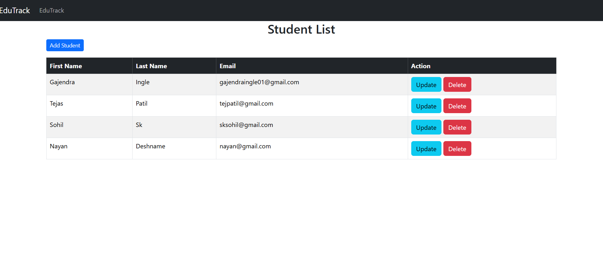

# 📚 EduTrack - Student Management System

**EduTrack** is a web-based **Student Management System** designed to efficiently manage student records. Built using **Spring Boot**, **Hibernate**, and **Thymeleaf**, it provides a user-friendly interface to perform CRUD operations on student data. With **Bootstrap**, the application ensures a responsive and visually appealing design.

## 🚀 Features 

- 🏠 **Home Page**: Welcomes users to the system.
- 📋 **View All Students**: Displays a list of all students.
- ➕ **Add Student**: Provides a form to add a new student.
- ✏️ **Edit Student**: Allows updating existing student details.
- 🗑️ **Delete Student**: Enables deletion of student records.

## 🛠️ Technologies Used 

- **Backend**: Spring Boot, Hibernate
- **Frontend**: Thymeleaf, Bootstrap
- **Database**: MySQL 
- **Build Tool**: Maven

## 🌐 Endpoints Overview

| **HTTP Method** | **URL**               | **Description**                  |
|------------------|-----------------------|-----------------------------------|
| GET              | `/home`              | Displays the home page.           |
| GET              | `/students`          | Lists all students.               |
| GET              | `/students/new`      | Form to add a new student.        |
| POST             | `/students`          | Saves a new student.              |
| GET              | `/students/edit/{id}`| Form to edit a student.           |
| POST             | `/students/edit/{id}`| Updates the student record.       |
| GET              | `/students/{id}`     | Deletes a student record.         |

## 🎨 Screenshots

### Home Page  
  

### Add Student  
  

### Edit Student  
  

---

Thank you for exploring **EduTrack**!  
Happy coding! 🚀  

